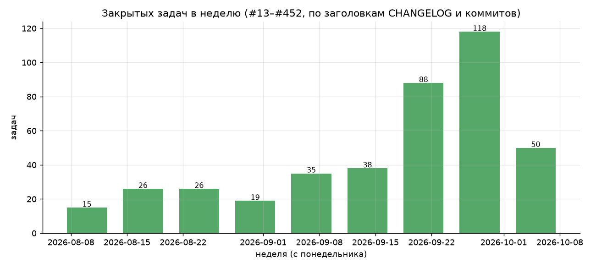
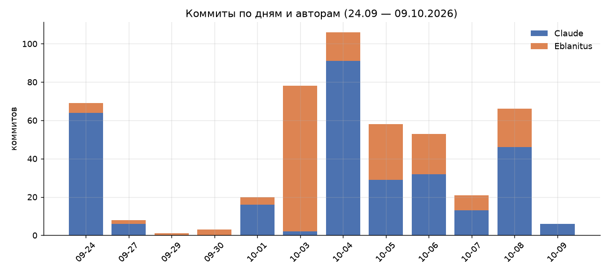
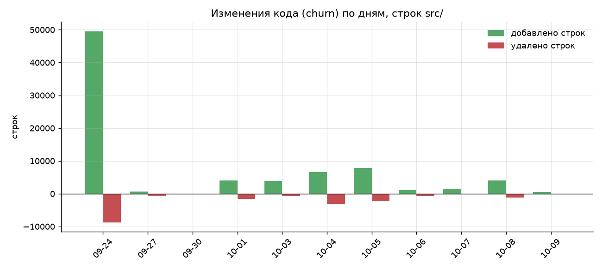
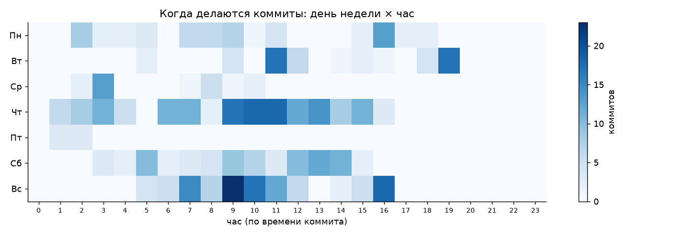
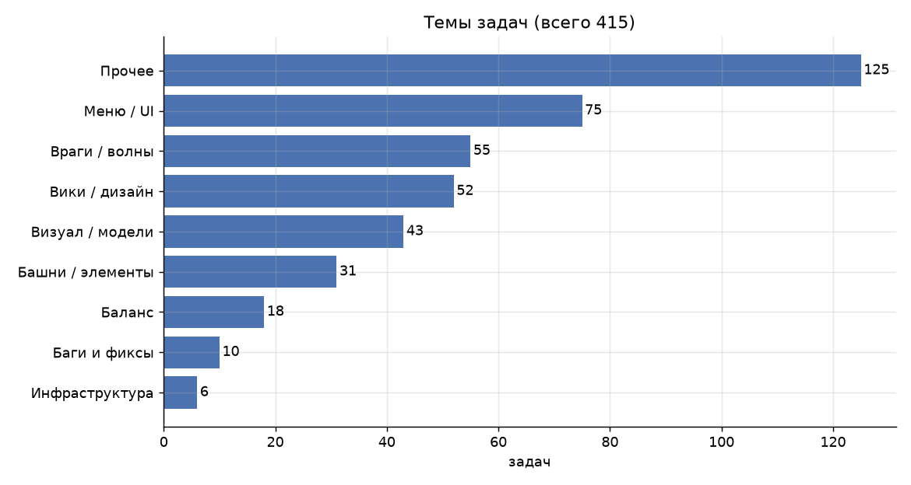
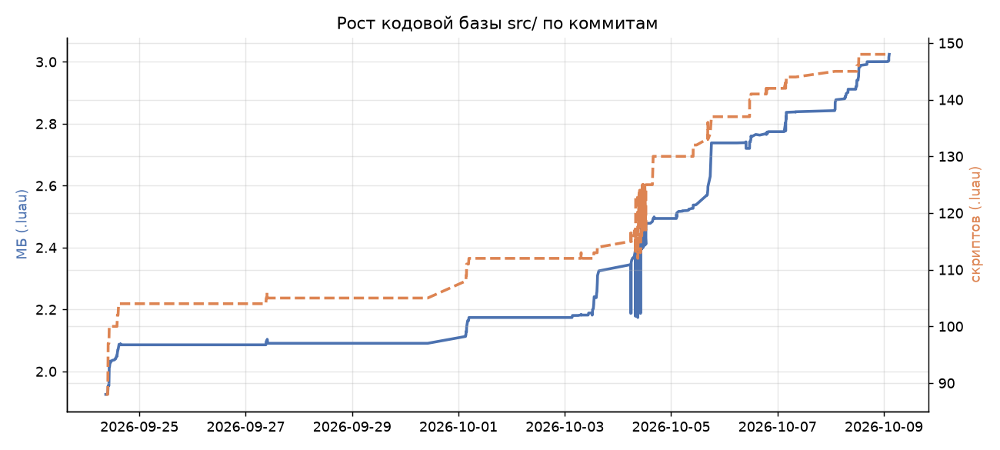
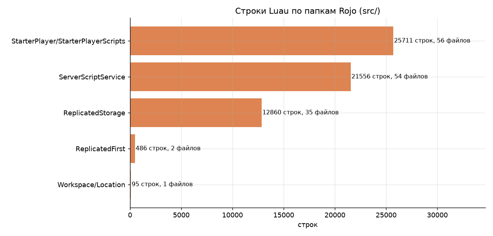
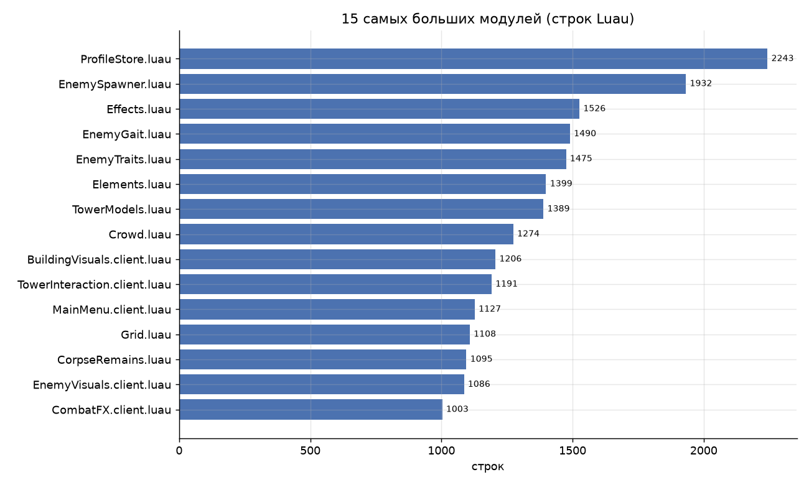
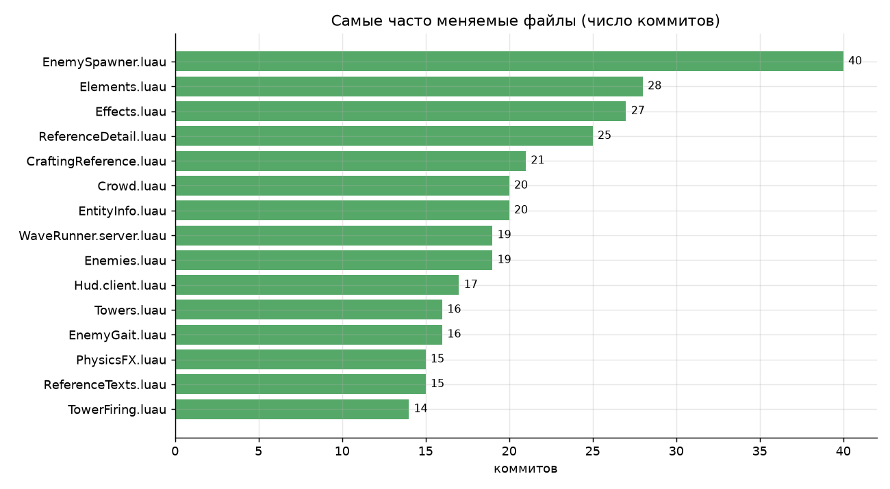

# Анализ проекта «Алхимический Tower Defense» (Roblox)

Данные: `git log` (489 коммитов, 24.09.2026 — 09.10.2026), архивный `Устаревшие документы/CHANGELOG.md` (задачи #13–#232 с датами), текущее состояние `src/`. Все времена — UTC. Графики строит `analysis/build_charts.py`, цифры — `analysis/metrics.json`.

## 1. Коротко

- **Что это:** tower defense с алхимическими элементами в бункере: башни, жуки-враги (27 видов), крафт, волны, поток жуков, справочник, стол-алхимическая установка.
- **Скорость:** в августе — 15–26 задач в неделю; в последние две недели — 88 и 118 задач (пик — неделя 22–28 сентября и неделя 29 сентября — 4 октября). Темп вырос в ~5–8 раз.
- **Объём:** 148 Luau-скриптов, ~60,7 тыс. строк, ~3,0 МБ. За 16 дней Git-истории добавлено 79,9 тыс. строк и удалено 19,1 тыс.
- **Команда:** два автора — агент «Claude» (305 коммитов, 62%) и человек «Eblanitus» (184 коммита, 38%). Человек в основном ставит ревью/мержит PR (86 merge-коммитов «Merge pull request»), задачи ставит и принимает решения по дизайну.

## 2. Работа и её динамика



Задачи по неделям: 15 → 26 → 26 → 19 → 35 → 38 → 88 → 118 → 50 (последняя неделя неполная, на момент анализа 09.10). Рост совпадает с переходом к работе через Git (24.09) и с вводом в игру волн потока и стола.



Пик — 04.10 (107 коммитов). Первый день (24.09, 69 коммитов) — импорт существующего проекта в `src/` и переезд на Rojo, поэтому он дал огромный всплеск строк.



Без учёта импорта 24.09 основная масса изменений — 4–5 октября (≈8 тыс. строк добавлено в каждый из этих дней).



Работа идёт в основном утром и днём (пик 9–11 UTC), заметен и воскресный пик.

## 3. Темы задач



Из 415 задач: «Меню / UI» (75), «Враги / волны» (55), «Вики / дизайн» (52), «Визуал / модели» (43), «Башни / элементы» (31), «Баланс» (18), «Баги и фиксы» (10), «Инфраструктура» (6). Классификация по ключевым словам заголовков, около 125 задач попали в «Прочее» — цифры ориентировочные.

Заметно: пропорция багфиксов мала (10 из 415). Либо большинство задач — фичи, либо фиксы не помечаются в заголовках. Стоит проверить по телам коммитов.

## 4. Кодовая база



Рост: 88 скриптов и 1,93 МБ на старте → 148 скриптов и 3,02 МБ сейчас. Ступени на графике — крупные пачки задач. Всплеск 03–05.10 — серия PR по жукам (задачи #394–#402: модели для остальных 19 видов, автоподготовка `prepare_beetles`).



Распределение: `StarterPlayerScripts` (клиент) — 25,7 тыс. строк, `ServerScriptService` (сервер) — 21,6 тыс., `ReplicatedStorage` (общие таблицы и модули) — 12,9 тыс. Клиентской логики больше, чем серверной: большой объём UI, справочника и визуальных эффектов.



Самые большие модули: `ProfileStore` (2242 строки), `EnemySpawner` (1932), `Effects` (1526), `EnemyGait` (1490), `EnemyTraits` (1475). 16 файлов длиннее 1000 строк. `CLAUDE.md` советует не открывать файлы крупнее 60 КБ целиком — несколько модулей уже близко к этому порогу.



Наибольший churn: `EnemySpawner` (40 коммитов), `Elements` (28), `Effects` (27), `ReferenceDetail` (25), `CraftingReference` (21), `Crowd` (20). Это ядро игры: появление жуков, элементы и эффекты, справочник. Здесь же самые вероятные места для регрессий.

## 5. Не-кодовые артефакты

- 38 RemoteEvent (файлами в `Remotes/`), 25 звуков `.ogg`, 27 моделей жуков `.glb`, 65 масок узоров элементов, 10 дизайн-документов в `ВИКИПЕДИЯ/` и 19 архивных.
- `place/game.rbxl` (бинарный снимок места) изменён в 220 коммитах из 489. Это бинарный файл: diff не читается, а размер истории растёт быстро. 4 коммита называются «Пересборка места».

## 6. Наблюдения и риски

1. **Скорость растёт, но качество не измеряется.** Автотестов в `src/` нет (найдено только 2 файла с `test`/`spec` в имени — их роль стоит проверить), проверка идёт в Studio вручную. По мере роста кода (около 60 тыс. строк) это главный риск.
2. **Бинарный `place/game.rbxl` в Git** — 220 изменений. Стоит держать в LFS или реже коммитить.
3. **Большие модули.** `ProfileStore`, `EnemySpawner` и т. п. растут быстро и уже тяжело читать; полезно делить по ответственности (как это уже сделано для `CraftingUI`).
4. **Багфиксы не помечаются.** Нужен единый префикс или тег в заголовках (например `fix:`), чтобы видеть долю багфиксов.
5. **Дизайн-документы и код.** Задач «Вики / дизайн» — 52 (около 12%). Правила живут в `ВИКИПЕДИЯ/` и `RULES.md`, и их синхронизация с кодом — ручная работа; стоит проверять, что документы не расходятся с таблицами в коде.

## 7. Воспроизведение

```
python analysis/build_charts.py    # нужны matplotlib и pandas
```

Ограничения: номера задач берутся из заголовков коммитов и CHANGELOG; 221 коммит без номера не учтён в «задачах»; классификация тем — по ключевым словам и ориентировочна; времена в UTC.
